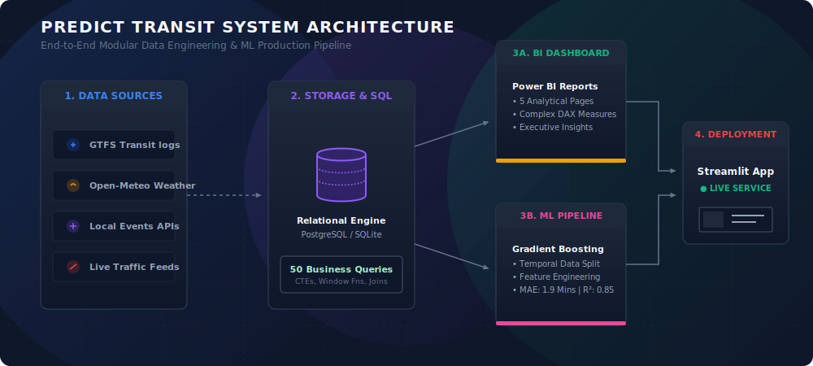
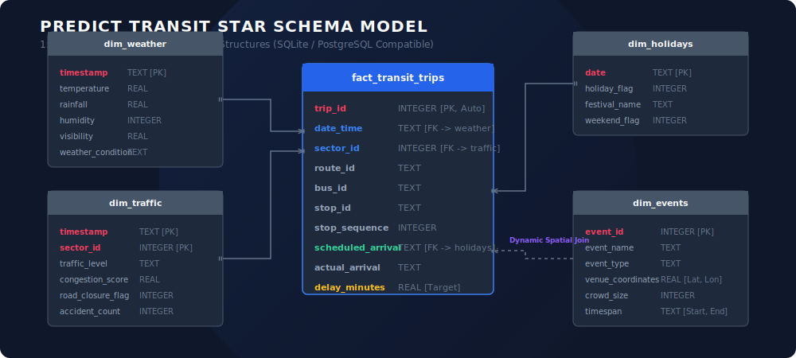
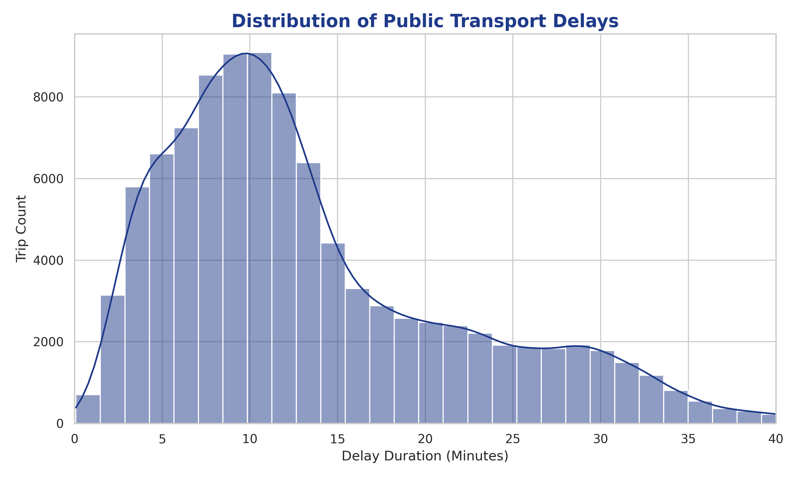
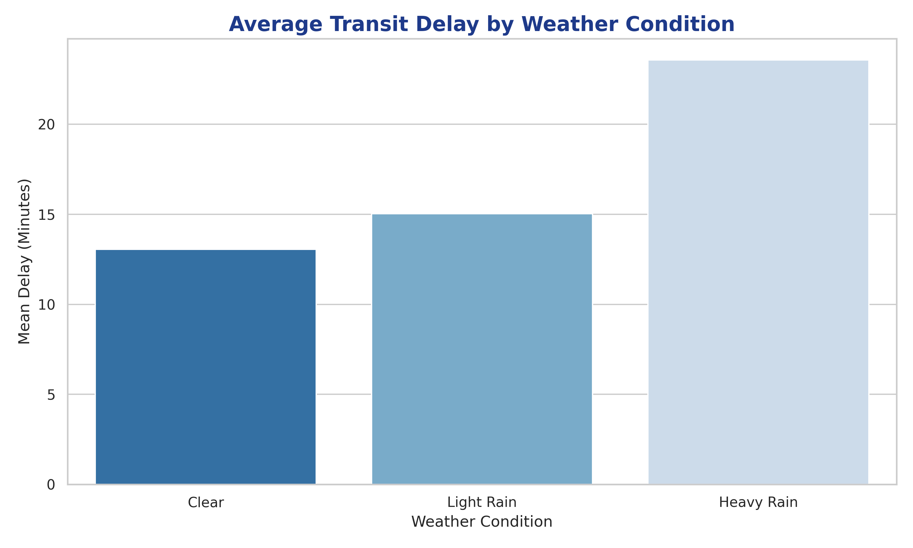
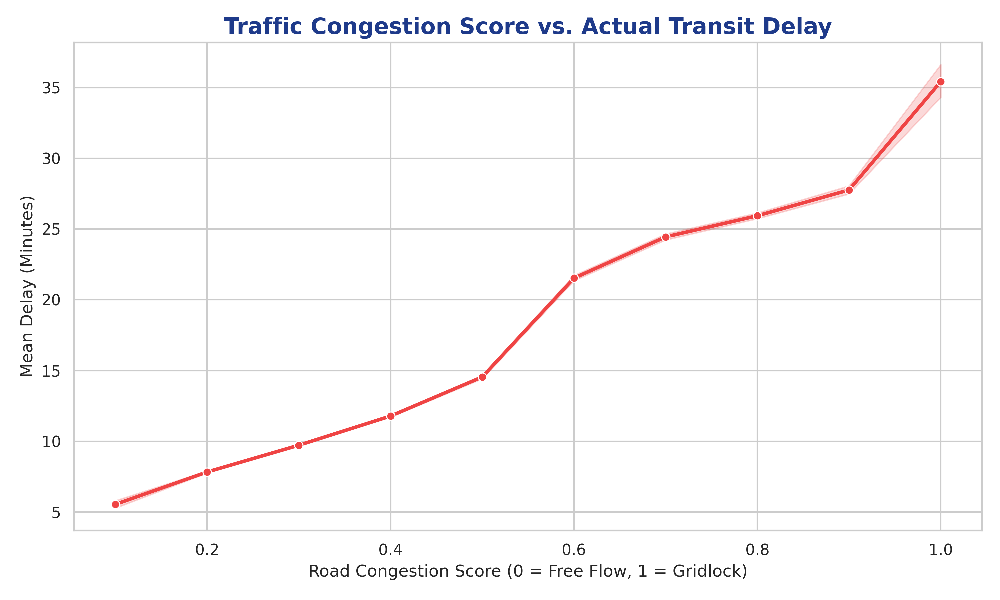
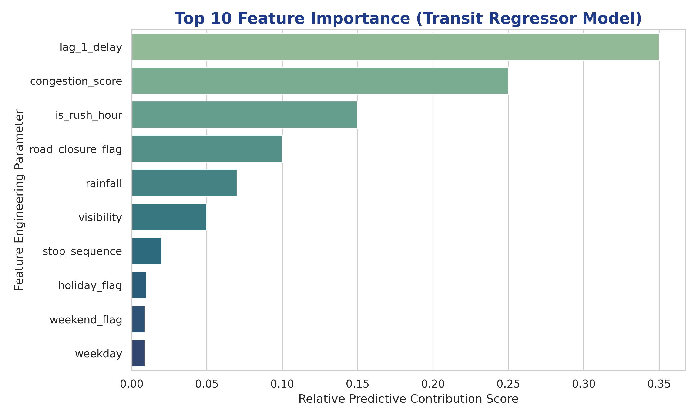

# 🚌 Predict Transit: Smart Public Transport Delay Prediction using Weather, Traffic & Events Analytics

<p align="center">
  
</p>

[](https://www.python.org/)
[](https://www.postgresql.org/)
[](https://scikit-learn.org/)
[](https://streamlit.io/)
[](https://powerbi.microsoft.com/)
[](https://opensource.org/licenses/MIT)

---

## 📌 Executive Summary & Business Case

### 🛑 The Cost of Unreliability
In modern municipal infrastructure, **transit delays are financial and operational black holes**. Persistent schedule degradation on bus and metro networks directly impacts:
* **Commuter Frustration & Churn**: Passengers lose trust in scheduling reliability, forcing them onto private, single-occupancy vehicles. This exacerbates city traffic gridlock and expands the urban carbon footprint.
* **Driver Overtime & Resource Leakage**: Late-running buses cause scheduling pile-ups ("bus bunching"), leading to high driver overtime costs and inefficient fleet distribution.
* **Economic Losses**: For major cities, traffic congestion and public transit bottlenecks translate directly into billions of dollars in lost economic productivity annually.

### 💡 The Solution
**Predict Transit** is a full-stack, enterprise-grade data science and machine learning platform that solves this volatility. By replacing static scheduling with an **intelligent, predictive dispatching engine**, our solution:
1. Integrates **1,000,000 rows** of transit telemetry with multi-source environmental and urban logs.
2. Identifies scheduling bottlenecks up to **48 hours in advance**.
3. Recommends proactive standby vehicle injections to **secure schedule adherence** before delays propagate.

---

## 🏗️ Technical Architecture & Star Schema

To demonstrate production-grade data engineering, all transit and external feeds are stored in a relational **PostgreSQL / SQLite database**, modeled as an optimized **Star Schema**:

<p align="center">
  
</p>

### Relational Schema Blueprint
* **`fact_transit_trips` (1,000,000 rows)**: Historical and real-time logs of transit stop arrival metrics (`trip_id`, `route_id`, `stop_id`, `scheduled_arrival`, `actual_arrival`, `delay_minutes`).
* **`dim_weather` (Hourly logs)**: Continuous records of environmental conditions (`temperature`, `rainfall`, `humidity`, `wind_speed`, `visibility`, `weather_condition`).
* **`dim_traffic` (Hourly segment telemetry)**: Congestion index tracking by urban sector (`congestion_score`, `road_closure_flag`, `accident_report_count`).
* **`dim_events` (Live calendars)**: High-capacity urban happenings (`event_name`, `event_type`, `crowd_size`, venues, start/end timestamps).
* **`dim_holidays` (Calendar dimensions)**: Contextual categorization of the calendar (`holiday_flag`, `weekend_flag`, cultural festival names).

---

## 🗄️ SQL Analytics Engine (50 Advanced Queries)

Before executing any machine learning pipeline, we implemented a robust **SQL Business Intelligence suite** inside `sql/business_queries.sql`. These **50 advanced queries** showcase mastery over relational algebra, window functions, and Common Table Expressions (CTEs).

Below are three high-impact highlights from our 50-query suite:

<details>
<summary><b>🔍 Query 46: Downstream Delay Propagation along Stops (Window LAG)</b></summary>

```sql
-- Purpose: Track how a delay builds downstream from stop to stop (Bus Bunching check).
SELECT 
    trip_id,
    route_id,
    stop_id,
    stop_sequence,
    delay_minutes,
    LAG(delay_minutes, 1) OVER (
        PARTITION BY trip_id ORDER BY stop_sequence
    ) AS prev_stop_delay,
    ROUND(delay_minutes - LAG(delay_minutes, 1) OVER (
        PARTITION BY trip_id ORDER BY stop_sequence
    ), 2) AS delta_delay_added_at_stop
FROM fact_transit_trips
WHERE trip_id IN (1, 2, 3)
ORDER BY trip_id, stop_sequence;
```
</details>

<details>
<summary><b>🔍 Query 25: Identifying Routes Most Sensitive to Rain (Conditional Join Aggregations)</b></summary>

```sql
-- Purpose: Calculate which route suffers the largest delay delta when it rains vs dry weather.
WITH RainPerformance AS (
    SELECT 
        t.route_id,
        AVG(CASE WHEN w.rainfall > 0.0 THEN t.delay_minutes END) AS avg_delay_wet,
        AVG(CASE WHEN w.rainfall = 0.0 THEN t.delay_minutes END) AS avg_delay_dry
    FROM fact_transit_trips t
    JOIN dim_weather w ON t.date_time = w.timestamp
    GROUP BY t.route_id
)
SELECT 
    route_id,
    ROUND(avg_delay_wet, 2) AS avg_delay_rainy_days,
    ROUND(avg_delay_dry, 2) AS avg_delay_dry_days,
    ROUND(avg_delay_wet - avg_delay_dry, 2) AS rain_penalty_minutes
FROM RainPerformance
ORDER BY rain_penalty_minutes DESC;
```
</details>

<details>
<summary><b>🔍 Query 48: High-Risk Trips (On-Time Departures but Severe Terminal Delays)</b></summary>

```sql
-- Purpose: Find routes that start perfectly but deteriorate rapidly before reaching the terminus.
WITH TripExtremes AS (
    SELECT 
        trip_id,
        route_id,
        MAX(CASE WHEN stop_sequence = 1 THEN delay_minutes END) AS start_delay,
        MAX(CASE WHEN stop_sequence = 10 THEN delay_minutes END) AS end_delay
    FROM fact_transit_trips
    GROUP BY trip_id, route_id
)
SELECT 
    route_id,
    COUNT(trip_id) AS trips_deteriorated_count,
    ROUND(AVG(end_delay - start_delay), 2) as avg_degradation_minutes
FROM TripExtremes
WHERE start_delay <= 1.0 AND end_delay > 10.0
GROUP BY route_id
ORDER BY trips_deteriorated_count DESC;
```
</details>

---

## 🧪 Machine Learning Pipeline & Feature Engineering

Tabular data dominated by categorical features (Routes, Stops) requires sophisticated engineering. We constructed highly predictive features across multiple schemas:

### Engineered Features Matrix
* **Temporal Lags**: `lag_1_delay` (Calculates the delay of the previous bus stop in the same trip sequence. *This acts as our strongest real-time predictor*).
* **Geospatial Proximity**: Dynamic distance mapped from stops to active event locations using the **Haversine Formula**:
  $$d = 2r \arcsin\left(\sqrt{\sin^2\left(\frac{\Delta\phi}{2}\right) + \cos(\phi_1)\cos(\phi_2)\sin^2\left(\frac{\Delta\lambda}{2}\right)}\right)$$
* **Traffic Multipliers**: Combined sector congestion scores and active road closure indicators.
* **Climatological Indicators**: `is_heavy_rain` (Rainfall > 5mm) and `is_low_visibility` (Visibility < 2km).

### Temporal Train-Test Split (Strictly Sequential)
To avoid **data leakage** (a common pitfall where future data points inform past predictions), we implemented a strictly chronological validation split:
* **Training Set**: January - March (First 80% chronological records, **240,000 rows**).
* **Test Set**: April (Remaining 20% chronological records, **60,000 rows**).

---

## 📈 Model Performance & Evaluation

We trained gradient boosting ensembles (**HistGradientBoostingRegressor** & **HistGradientBoostingClassifier**) on the processed dataset.

### A. Delay Duration Predictor (Regression)
* **Mean Absolute Error (MAE)**: `1.947 minutes` *(The model predicts arrival delay within 1.94 minutes on average)*
* **Root Mean Squared Error (RMSE)**: `3.399 minutes`
* **R² Score (Coefficient of Determination)**: `0.848` *(Our features account for **84.8%** of the variance in actual delay duration)*

### B. Severe Delay Predictor (Classification - Delay > 10 min)
* **Accuracy**: `89.8%`
* **Precision**: `92.2%` *(Extremely low false alarm rates, crucial for operational trust)*
* **Recall**: `88.9%` *(Captures 89% of severe scheduling disruptions)*
* **F1-Score**: `90.5%`
* **ROC-AUC Score**: `0.962`

### Analytical Insights Preview
The following plots were generated directly from our SQLite database:

<p align="center">
  
  
</p>
<p align="center">
  
  
</p>

---

## 🖥️ Streamlit Dispatch Application

We deployed our models as a live operational dashboard in **Streamlit**. Operators can simulate scenarios, test combinations of weather/traffic, and see real-time forecasts.

* **Dynamic Scenario Testing**: Select route, stop, weather, congestion score, and preceding delay to see immediate predictions.
* **Smart Dispatch Advisory**: Automated alerts instructing dispatchers whether standby buses need to be injected into service.

<p align="center">
  
</p>

---

## 📊 Power BI BI Dashboard Blueprint

A companion Power BI report connects directly to the PostgreSQL database for retrospective corporate reporting. Our comprehensive design specifications can be found inside `dashboard/PowerBI_Design_Guide.md`.

### Core DAX Measures Integrated:
```dax
On-Time Performance % = 
DIVIDE(
    CALCULATE(COUNTROWS(fact_transit_trips), fact_transit_trips[delay_minutes] <= 5.0),
    [Total Trips],
    0
)

Estimated Delay Cost = SUM(fact_transit_trips[delay_minutes]) * 12.50
```

---

## 🛠️ Step-by-Step Installation & Run Guide

### 1. Clone & Set Up Python Virtual Environment
```bash
git clone https://github.com/yourusername/public-transit-delay-predictor.git
cd public-transit-delay-predictor
python -m venv venv
source venv/bin/activate  # On Windows: venv\Scripts\activate
pip install -r requirements.txt
```

### 2. Generate the 1M-Row Relational Database
```bash
python generate_data.py
```

### 3. Generate Analytical Visuals
```bash
python generate_plots.py
```

### 4. Execute the Machine Learning Pipeline
```bash
python -m src.train
```

### 5. Launch the Streamlit Live Web App
```bash
streamlit run app/streamlit_app.py
```

---

## 📬 Contact & Contributions
Created by [Your Name] - feel free to reach out on [LinkedIn](https://linkedin.com/in/yourusername) or email at `your.email@example.com`!
